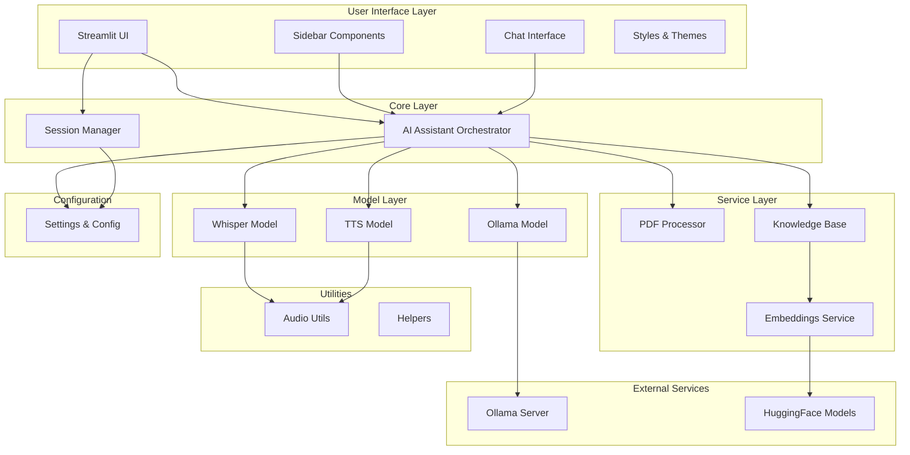
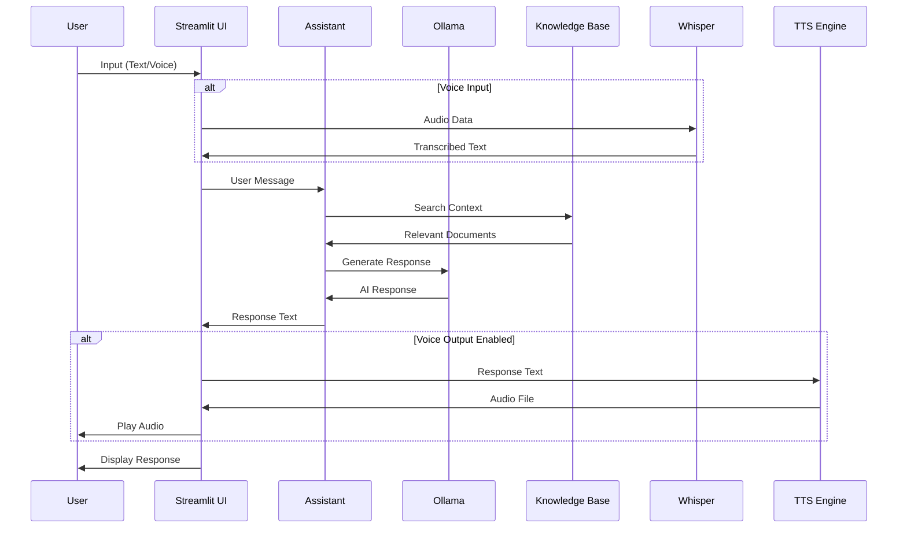

# 🤖 Local AI Assistant - Developer Guide

## Table of Contents
1. [Project Overview](#project-overview)
2. [Architecture](#architecture)
3. [Project Structure](#project-structure)
4. [Core Components](#core-components)
5. [Configuration System](#configuration-system)
6. [Adding New Features](#adding-new-features)
7. [Customization Guide](#customization-guide)
8. [Troubleshooting](#troubleshooting)
9. [Performance Optimization](#performance-optimization)
10. [Deployment](#deployment)

## Project Overview

The Local AI Assistant is a modular, privacy-focused AI application that runs entirely on your local machine. It combines multiple AI technologies without requiring API keys or cloud services.

### Key Features
- 🦙 **Local LLM Integration** via Ollama
- 🎤 **Speech Recognition** using OpenAI Whisper
- 🔊 **Text-to-Speech** with pyttsx3
- 📄 **PDF Processing** and knowledge base creation
- 🧠 **Vector Search** with FAISS and HuggingFace embeddings
- 💬 **Interactive Chat Interface** built with Streamlit

### Technology Stack
```
Frontend: Streamlit
AI Models: Ollama (LLM), Whisper (STT), pyttsx3 (TTS)
Vector DB: FAISS
Embeddings: HuggingFace Sentence Transformers
PDF Processing: PyPDF2
Memory: LangChain ConversationBufferMemory
```

## Architecture

### System Architecture Diagram


### Data Flow Diagram


## Project Structure

```
local_ai_assistant/
├── 📄 app.py                      # Main application entry point
├── 📄 requirements.txt            # Python dependencies
├── 📄 DEVELOPER_GUIDE.md          # This guide
├── 📄 .cursorrules                # Development notes
├── 📁 .streamlit/                 # Streamlit configuration
│   └── 📄 config.toml            # App configuration
├── 📁 config/                     # Configuration management
│   ├── 📄 __init__.py
│   └── 📄 settings.py            # Application settings
├── 📁 core/                       # Core business logic
│   ├── 📄 __init__.py
│   ├── 📄 session_manager.py     # Session state management
│   └── 📄 assistant.py           # Main orchestrator
├── 📁 models/                     # AI model interfaces
│   ├── 📄 __init__.py
│   ├── 📄 ollama_model.py        # Ollama LLM wrapper
│   ├── 📄 whisper_model.py       # Speech recognition
│   └── 📄 tts_model.py           # Text-to-speech
├── 📁 services/                   # Business services
│   ├── 📄 __init__.py
│   ├── 📄 pdf_processor.py       # PDF text extraction
│   ├── 📄 knowledge_base.py      # Vector database
│   └── 📄 embeddings.py          # Embedding service
├── 📁 ui/                         # User interface components
│   ├── 📄 __init__.py
│   ├── 📄 components.py          # Reusable UI components
│   ├── 📄 sidebar.py             # Sidebar interface
│   ├── 📄 chat_interface.py      # Main chat UI
│   └── 📄 styles.py              # CSS styling
└── 📁 utils/                      # Utility functions
    ├── 📄 __init__.py
    ├── 📄 audio_utils.py         # Audio processing
    └── 📄 helpers.py             # General utilities
```

## Core Components

### 1. Application Entry Point (`app.py`)

**Purpose**: Main Streamlit application that initializes all components and handles the application lifecycle.

**Key Functions**:
- Page configuration
- Component initialization
- Error handling for PyTorch compatibility

**Code Structure**:
```python
def main():
    # 1. Configure Streamlit page
    st.set_page_config(...)
    
    # 2. Apply custom styling
    apply_custom_styles()
    
    # 3. Initialize session management
    session_manager = SessionManager()
    
    # 4. Create AI assistant
    assistant = LocalAIAssistant(session_manager)
    
    # 5. Render UI components
    render_sidebar(assistant, session_manager)
    render_chat_interface(assistant, session_manager, settings)
```

**Customization Points**:
- Change page title, icon, or layout
- Add new initialization steps
- Modify error handling

### 2. Configuration System (`config/settings.py`)

**Purpose**: Centralized configuration management using dataclasses for type safety.

**Configuration Classes**:

```python
@dataclass
class WhisperConfig:
    model_size: str = "base"                    # Whisper model size
    available_sizes: List[str] = [...]          # Available options

@dataclass
class OllamaConfig:
    base_url: str = "http://localhost:11434"   # Ollama server URL
    default_model: str = "llama3.2"            # Default model
    available_models: List[str] = [...]         # Model options
    timeout: int = 5                           # Connection timeout

@dataclass
class TTSConfig:
    rate: int = 150                            # Speech rate
    volume: float = 0.9                        # Volume level

@dataclass
class EmbeddingConfig:
    model_name: str = "sentence-transformers/all-MiniLM-L6-v2"
    chunk_size: int = 1000                     # Text chunk size
    chunk_overlap: int = 200                   # Overlap between chunks
```

**How to Modify**:
1. Add new configuration parameters to existing classes
2. Create new configuration classes for new features
3. Update `AppConfig` to include new configurations

**Example - Adding New Model Support**:
```python
@dataclass
class NewModelConfig:
    model_path: str = "/path/to/model"
    max_tokens: int = 2048
    temperature: float = 0.7

@dataclass
class AppConfig:
    # ... existing configs ...
    new_model: NewModelConfig = None
    
    def __post_init__(self):
        # ... existing init ...
        if self.new_model is None:
            self.new_model = NewModelConfig()
```

### 3. Session Management (`core/session_manager.py`)

**Purpose**: Manages Streamlit session state and provides a clean interface for state operations.

**Key Features**:
- Centralized state initialization
- Type-safe state access
- Conversation history management
- PDF text storage

**State Variables**:
```python
defaults = {
    'chat_history': [],                    # Conversation messages
    'conversation_memory': None,           # LangChain memory
    'pdf_knowledge_base': None,           # FAISS vector store
    'pdf_texts': [],                      # Processed PDF content
    'tts_engine': None,                   # TTS engine instance
    'whisper_model': None,                # Loaded Whisper model
    'ollama_status': {...},               # Ollama connection status
    'selected_model': None,               # Currently selected LLM
    'enable_speech_input': True,          # Voice input toggle
    'enable_speech_output': False,        # Voice output toggle
    'whisper_model_size': 'base'          # Whisper model size
}
```

**How to Add New State Variables**:
```python
def initialize(self):
    defaults = {
        # ... existing defaults ...
        'new_feature_enabled': False,
        'new_feature_config': {},
    }
```

### 4. AI Assistant Orchestrator (`core/assistant.py`)

**Purpose**: Central coordinator that manages all AI models and services.

**Architecture**:
```python
class LocalAIAssistant:
    def __init__(self, session_manager):
        self.session_manager = session_manager
        self.config = AppConfig()
        
        # Initialize models
        self.ollama = OllamaModel(self.config.ollama)
        self.whisper = WhisperModel(self.config.whisper)
        self.tts = TTSModel(self.config.tts)
        
        # Initialize services
        self.pdf_processor = PDFProcessor()
        self.knowledge_base = KnowledgeBase(self.config.embedding)
```

**Key Methods**:
- `check_ollama_status()`: Verify Ollama connection
- `process_pdfs()`: Handle PDF uploads and processing
- `speech_to_text()`: Convert audio to text
- `text_to_speech()`: Generate audio from text
- `get_ai_response()`: Generate contextual AI responses

**Adding New AI Models**:
1. Create model wrapper in `models/` directory
2. Add configuration in `config/settings.py`
3. Initialize in `LocalAIAssistant.__init__()`
4. Add public methods for model interaction

## Model Layer

### 1. Ollama Model (`models/ollama_model.py`)

**Purpose**: Interface for local LLM inference via Ollama.

**Key Features**:
- Connection status checking
- Model installation
- Context-aware response generation
- Conversation history integration

**Response Generation Flow**:
```python
def generate_response(self, user_input, model_name, knowledge_base=None, chat_history=None):
    # 1. Create LLM instance
    llm = Ollama(model=model_name, base_url=self.base_url)
    
    # 2. Extract context from knowledge base
    context = self._extract_context(knowledge_base, user_input)
    
    # 3. Build conversation context
    conversation_context = self._build_conversation_context(chat_history)
    
    # 4. Create full prompt
    full_prompt = f"{system_prompt}\n{conversation_context}\nHuman: {user_input}\nAssistant:"
    
    # 5. Generate response
    return llm(full_prompt)
```

**Customization Options**:
- Modify system prompt templates
- Adjust context window size
- Add new prompt engineering techniques
- Implement response filtering

### 2. Whisper Model (`models/whisper_model.py`)

**Purpose**: Speech-to-text conversion using OpenAI Whisper.

**Model Loading**:
```python
def load_model(self, model_size: str):
    with st.spinner(f"Loading Whisper {model_size} model..."):
        return whisper.load_model(model_size)
```

**Audio Processing**:
```python
def transcribe(self, audio_data: bytes, model):
    # 1. Save audio to temporary file
    with tempfile.NamedTemporaryFile(delete=False, suffix=".wav") as tmp_file:
        tmp_file.write(audio_data)
        tmp_file_path = tmp_file.name
    
    # 2. Transcribe audio
    result = model.transcribe(tmp_file_path)
    
    # 3. Clean up temporary file
    os.unlink(tmp_file_path)
    
    return result["text"]
```

**Model Size Options**:
- `tiny`: Fastest, least accurate
- `base`: Good balance (default)
- `small`: Better accuracy
- `medium`: High accuracy
- `large`: Best accuracy, slowest

### 3. TTS Model (`models/tts_model.py`)

**Purpose**: Text-to-speech conversion using pyttsx3.

**Engine Configuration**:
```python
def init_engine(self):
    engine = pyttsx3.init()
    voices = engine.getProperty('voices')
    if voices:
        engine.setProperty('voice', voices[0].id)
    engine.setProperty('rate', self.config.rate)
    engine.setProperty('volume', self.config.volume)
    return engine
```

**Audio Generation**:
```python
def generate_audio(self, text: str, engine):
    with tempfile.NamedTemporaryFile(delete=False, suffix=".wav") as tmp_file:
        engine.save_to_file(text, tmp_file.name)
        engine.runAndWait()
        return tmp_file.name
```

## Service Layer

### 1. PDF Processor (`services/pdf_processor.py`)

**Purpose**: Extract text content from PDF files.

**Text Extraction**:
```python
def extract_text(self, pdf_file):
    pdf_reader = PyPDF2.PdfReader(io.BytesIO(pdf_file.read()))
    text = ""
    for page in pdf_reader.pages:
        text += page.extract_text() + "\n"
    return text
```

**Enhancement Ideas**:
- Add support for OCR (pytesseract)
- Handle encrypted PDFs
- Extract images and tables
- Support other document formats (DOCX, TXT)

### 2. Knowledge Base (`services/knowledge_base.py`)

**Purpose**: Create and manage vector databases for semantic search.

**Vector Store Creation**:
```python
def create_from_texts(self, texts: List[str]):
    # 1. Split texts into chunks
    chunks = []
    for text in texts:
        chunks.extend(self.text_splitter.split_text(text))
    
    # 2. Create embeddings and vector store
    knowledge_base = FAISS.from_texts(chunks, self.embeddings)
    return knowledge_base
```

**Text Chunking Strategy**:
- **Chunk Size**: 1000 characters (configurable)
- **Overlap**: 200 characters (prevents context loss)
- **Splitter**: Recursive character splitter (preserves structure)

**Customization Options**:
- Adjust chunk size for different content types
- Implement custom splitting strategies
- Add metadata to chunks
- Use different vector stores (Chroma, Pinecone)

### 3. Embeddings Service (`services/embeddings.py`)

**Purpose**: Generate vector embeddings for text using HuggingFace models.

**Lazy Loading Pattern**:
```python
def _get_embeddings(self):
    if self.embeddings is None:
        try:
            from langchain_community.embeddings import HuggingFaceEmbeddings
            self.embeddings = HuggingFaceEmbeddings(model_name=self.model_name)
        except Exception as e:
            st.error(f"Error loading embeddings model: {str(e)}")
            return None
    return self.embeddings
```

**Model Options**:
- `all-MiniLM-L6-v2`: Fast, good quality (default)
- `all-mpnet-base-v2`: Higher quality, slower
- `multi-qa-MiniLM-L6-cos-v1`: Optimized for Q&A

## User Interface Layer

### 1. Sidebar (`ui/sidebar.py`)

**Purpose**: Configuration panel for all application settings.

**Component Structure**:
```python
def render_sidebar(assistant, session_manager):
    with st.sidebar:
        # 1. Ollama status and model selection
        _render_ollama_status(assistant, session_manager)
        
        # 2. Model installation interface
        _render_model_installation(assistant, session_manager)
        
        # 3. Whisper configuration
        _render_whisper_settings(session_manager)
        
        # 4. Voice input/output toggles
        _render_voice_settings(session_manager)
        
        # 5. PDF upload interface
        _render_pdf_upload(assistant, session_manager)
        
        # 6. Document management
        _render_processed_pdfs(session_manager)
```

**Adding New Settings**:
1. Create a new `_render_*` function
2. Add it to the main `render_sidebar` function
3. Update session state in `session_manager.py`
4. Handle the setting in relevant components

### 2. Chat Interface (`ui/chat_interface.py`)

**Purpose**: Main conversation interface with input handling.

**Layout Structure**:
```python
def render_chat_interface(assistant, session_manager, settings):
    col1, col2 = st.columns([3, 1])
    
    with col1:
        # Main conversation area
        _render_conversation(session_manager)
        _handle_user_input(assistant, session_manager, settings)
    
    with col2:
        # Statistics and system status
        render_statistics(session_manager, settings)
```

**Input Processing Flow**:
```python
def _handle_user_input(assistant, session_manager, settings):
    # 1. Choose input method (text/voice)
    input_method = st.radio("Choose input method:", ["Text", "Voice"])
    
    # 2. Handle text input
    if input_method == "Text":
        user_input = st.chat_input("Type your message here...")
    
    # 3. Handle voice input
    elif input_method == "Voice":
        audio_bytes = audio_recorder(...)
        user_input = assistant.speech_to_text(audio_bytes)
    
    # 4. Process input and generate response
    if user_input:
        _process_user_input(user_input, assistant, session_manager, settings)
```

### 3. Components (`ui/components.py`)

**Purpose**: Reusable UI components for consistent styling.

**Message Rendering**:
```python
def render_chat_message(message):
    if message["role"] == "user":
        st.markdown(f'<div class="chat-message user-message">...')
    else:
        st.markdown(f'<div class="chat-message assistant-message">...')
```

**Statistics Display**:
```python
def render_statistics(session_manager, settings):
    # Session metrics
    st.metric("Messages", len(session_manager.get('chat_history', [])))
    st.metric("PDFs Processed", len(session_manager.get('pdf_texts', [])))
    
    # System status indicators
    if session_manager.get('pdf_knowledge_base'):
        st.success("✅ Knowledge Base Active")
```

### 4. Styles (`ui/styles.py`)

**Purpose**: CSS styling for the application interface.

**Style Categories**:
- **Headers**: Main title styling
- **Messages**: Chat bubble styling
- **Status**: Success/error/warning indicators
- **Sidebar**: Configuration panel styling

**Custom CSS Structure**:
```css
.main-header {
    font-size: 2.5rem;
    color: #1f77b4;
    text-align: center;
    margin-bottom: 2rem;
}

.chat-message {
    padding: 1rem;
    border-radius: 0.5rem;
    margin: 1rem 0;
}

.user-message {
    background-color: #e3f2fd;
    border-left: 5px solid #2196f3;
}
```

## Adding New Features

### 1. Adding a New AI Model

**Step 1**: Create Model Wrapper
```python
# models/new_model.py
class NewModel:
    def __init__(self, config):
        self.config = config
    
    def load_model(self):
        # Model loading logic
        pass
    
    def process(self, input_data):
        # Model inference logic
        pass
```

**Step 2**: Add Configuration
```python
# config/settings.py
@dataclass
class NewModelConfig:
    model_path: str = "/path/to/model"
    parameter1: int = 100
    parameter2: float = 0.5
```

**Step 3**: Integrate with Assistant
```python
# core/assistant.py
class LocalAIAssistant:
    def __init__(self, session_manager):
        # ... existing code ...
        self.new_model = NewModel(self.config.new_model)
    
    def use_new_model(self, input_data):
        return self.new_model.process(input_data)
```

**Step 4**: Add UI Components
```python
# ui/sidebar.py
def _render_new_model_settings(session_manager):
    st.subheader("🆕 New Model Settings")
    enabled = st.checkbox("Enable New Model")
    session_manager.set('new_model_enabled', enabled)
```

### 2. Adding a New Service

**Step 1**: Create Service Class
```python
# services/new_service.py
class NewService:
    def __init__(self, config):
        self.config = config
    
    def process_data(self, data):
        # Service logic
        return processed_data
```

**Step 2**: Add to Assistant
```python
# core/assistant.py
def __init__(self, session_manager):
    # ... existing code ...
    self.new_service = NewService(self.config.new_service)
```

**Step 3**: Create UI Interface
```python
# ui/new_service_ui.py
def render_new_service_interface(assistant, session_manager):
    st.subheader("New Service")
    # UI components for the service
```

### 3. Adding New File Format Support

**Example**: Adding DOCX Support
```python
# services/document_processor.py
import docx

class DocumentProcessor:
    def extract_text(self, file):
        if file.name.endswith('.pdf'):
            return self._extract_pdf_text(file)
        elif file.name.endswith('.docx'):
            return self._extract_docx_text(file)
        else:
            raise ValueError(f"Unsupported file format: {file.name}")
    
    def _extract_docx_text(self, file):
        doc = docx.Document(io.BytesIO(file.read()))
        text = ""
        for paragraph in doc.paragraphs:
            text += paragraph.text + "\n"
        return text
```

## Customization Guide

### 1. Changing the UI Theme

**Modify Streamlit Config** (`.streamlit/config.toml`):
```toml
[theme]
primaryColor = "#FF6B6B"           # Accent color
backgroundColor = "#FFFFFF"        # Main background
secondaryBackgroundColor = "#F0F0F0"  # Sidebar background
textColor = "#262730"              # Text color
```

**Update CSS Styles** (`ui/styles.py`):
```python
def apply_custom_styles():
    st.markdown("""
    <style>
        .main-header {
            color: #FF6B6B;  /* Match primary color */
        }
        
        .user-message {
            background-color: #FFE5E5;
            border-left: 5px solid #FF6B6B;
        }
    </style>
    """, unsafe_allow_html=True)
```

### 2. Adding Custom Prompts

**Create Prompt Templates**:
```python
# config/prompts.py
SYSTEM_PROMPTS = {
    "default": """You are a helpful AI assistant...""",
    "creative": """You are a creative writing assistant...""",
    "technical": """You are a technical expert...""",
    "casual": """You are a friendly, casual assistant..."""
}

def get_system_prompt(prompt_type="default", context=""):
    base_prompt = SYSTEM_PROMPTS.get(prompt_type, SYSTEM_PROMPTS["default"])
    if context:
        return f"{base_prompt}\n\nContext: {context}"
    return base_prompt
```

**Add Prompt Selection UI**:
```python
# ui/sidebar.py
def _render_prompt_settings(session_manager):
    st.subheader("🎭 Conversation Style")
    prompt_type = st.selectbox(
        "Choose style:",
        ["default", "creative", "technical", "casual"]
    )
    session_manager.set('prompt_type', prompt_type)
```

### 3. Custom Model Integration

**Example**: Adding Hugging Face Transformers
```python
# models/huggingface_model.py
from transformers import pipeline

class HuggingFaceModel:
    def __init__(self, config):
        self.config = config
        self.pipeline = None
    
    def load_model(self, model_name, task="text-generation"):
        self.pipeline = pipeline(task, model=model_name)
    
    def generate(self, prompt, max_length=100):
        if self.pipeline is None:
            raise ValueError("Model not loaded")
        
        result = self.pipeline(prompt, max_length=max_length)
        return result[0]['generated_text']
```

### 4. Adding Database Persistence

**Example**: SQLite Integration
```python
# services/database.py
import sqlite3
import json

class ConversationDatabase:
    def __init__(self, db_path="conversations.db"):
        self.db_path = db_path
        self.init_database()
    
    def init_database(self):
        conn = sqlite3.connect(self.db_path)
        cursor = conn.cursor()
        cursor.execute("""
            CREATE TABLE IF NOT EXISTS conversations (
                id INTEGER PRIMARY KEY AUTOINCREMENT,
                timestamp DATETIME DEFAULT CURRENT_TIMESTAMP,
                messages TEXT,
                metadata TEXT
            )
        """)
        conn.commit()
        conn.close()
    
    def save_conversation(self, messages, metadata=None):
        conn = sqlite3.connect(self.db_path)
        cursor = conn.cursor()
        cursor.execute(
            "INSERT INTO conversations (messages, metadata) VALUES (?, ?)",
            (json.dumps(messages), json.dumps(metadata or {}))
        )
        conn.commit()
        conn.close()
```

## Troubleshooting

### Common Issues and Solutions

#### 1. PyTorch Compatibility Errors
**Symptoms**: `RuntimeError: Tried to instantiate class '__path__._path'`

**Solution**: Already implemented in the project
- Environment variable: `TOKENIZERS_PARALLELISM=false`
- Streamlit config: `fileWatcherType = "none"`
- Lazy loading of PyTorch models

#### 2. Ollama Connection Issues
**Symptoms**: "Ollama not running" or connection timeouts

**Solutions**:
1. Start Ollama server: `ollama serve`
2. Check port availability: `netstat -an | findstr :11434`
3. Verify Ollama installation: `ollama --version`
4. Adjust timeout in config: `OllamaConfig.timeout = 10`

#### 3. Memory Issues with Large Models
**Symptoms**: Out of memory errors, slow performance

**Solutions**:
1. Use smaller Whisper models (`tiny`, `base`)
2. Reduce chunk size in embeddings config
3. Clear model cache: `whisper.load_model.cache_clear()`
4. Implement model unloading after use

#### 4. Audio Recording Issues
**Symptoms**: Microphone not working, audio quality problems

**Solutions**:
1. Check browser permissions for microphone
2. Test with different browsers (Chrome recommended)
3. Adjust audio quality settings
4. Use external audio files for testing

### Debug Mode

**Enable Debug Logging**:
```python
# app.py
import logging

logging.basicConfig(level=logging.DEBUG)
logger = logging.getLogger(__name__)

def main():
    logger.debug("Starting application...")
    # ... rest of the code
```

**Add Debug Information to UI**:
```python
# ui/components.py
def render_debug_info(session_manager):
    if st.checkbox("Show Debug Info"):
        st.json({
            "session_state_keys": list(st.session_state.keys()),
            "chat_history_length": len(session_manager.get('chat_history', [])),
            "models_loaded": {
                "whisper": session_manager.get('whisper_model') is not None,
                "tts": session_manager.get('tts_engine') is not None,
            }
        })
```

## Performance Optimization

### 1. Model Loading Optimization

**Lazy Loading Pattern**:
```python
class OptimizedModelManager:
    def __init__(self):
        self._models = {}
    
    def get_model(self, model_type, model_name):
        key = f"{model_type}_{model_name}"
        if key not in self._models:
            self._models[key] = self._load_model(model_type, model_name)
        return self._models[key]
    
    def unload_model(self, model_type, model_name):
        key = f"{model_type}_{model_name}"
        if key in self._models:
            del self._models[key]
```

### 2. Caching Strategies

**Streamlit Caching**:
```python
@st.cache_resource
def load_embeddings_model(model_name):
    return HuggingFaceEmbeddings(model_name=model_name)

@st.cache_data
def process_pdf_text(pdf_content):
    # Expensive PDF processing
    return processed_text
```

### 3. Memory Management

**Cleanup Functions**:
```python
def cleanup_temporary_files():
    temp_dir = tempfile.gettempdir()
    for file in os.listdir(temp_dir):
        if file.startswith("tmp") and file.endswith(".wav"):
            try:
                os.unlink(os.path.join(temp_dir, file))
            except:
                pass
```

### 4. Async Processing

**Background Tasks**:
```python
import asyncio
import threading

class AsyncProcessor:
    def __init__(self):
        self.executor = ThreadPoolExecutor(max_workers=2)
    
    def process_in_background(self, func, *args):
        future = self.executor.submit(func, *args)
        return future
```

## Deployment

### 1. Local Development Setup

**Requirements**:
```bash
# Install Python dependencies
pip install -r requirements.txt

# Install Ollama
curl -fsSL https://ollama.ai/install.sh | sh

# Pull a model
ollama pull llama3.2

# Start Ollama server
ollama serve
```

**Run Application**:
```bash
streamlit run app.py
```

### 2. Docker Deployment

**Dockerfile**:
```dockerfile
FROM python:3.11-slim

WORKDIR /app

# Install system dependencies
RUN apt-get update && apt-get install -y \
    portaudio19-dev \
    python3-pyaudio \
    && rm -rf /var/lib/apt/lists/*

# Copy requirements and install Python dependencies
COPY requirements.txt .
RUN pip install -r requirements.txt

# Copy application code
COPY . .

# Expose Streamlit port
EXPOSE 8501

# Run the application
CMD ["streamlit", "run", "app.py", "--server.address", "0.0.0.0"]
```

**Docker Compose**:
```yaml
version: '3.8'
services:
  ai-assistant:
    build: .
    ports:
      - "8501:8501"
    volumes:
      - ./data:/app/data
    environment:
      - TOKENIZERS_PARALLELISM=false
    depends_on:
      - ollama

  ollama:
    image: ollama/ollama
    ports:
      - "11434:11434"
    volumes:
      - ollama_data:/root/.ollama

volumes:
  ollama_data:
```

### 3. Production Considerations

**Security**:
- Use environment variables for sensitive configuration
- Implement user authentication if needed
- Set up HTTPS with reverse proxy
- Limit file upload sizes

**Monitoring**:
- Add health check endpoints
- Implement logging and metrics
- Monitor resource usage
- Set up error tracking

**Scalability**:
- Use Redis for session storage
- Implement model serving with multiple workers
- Add load balancing for multiple instances
- Consider GPU acceleration for models

### 4. Cloud Deployment

**AWS EC2 Example**:
```bash
# Launch EC2 instance with GPU (optional)
# Install Docker and Docker Compose
# Clone repository
# Configure environment variables
# Run with Docker Compose
```

**Configuration for Cloud**:
```python
# config/cloud_settings.py
import os

class CloudConfig:
    # Use environment variables for cloud deployment
    OLLAMA_URL = os.getenv('OLLAMA_URL', 'http://localhost:11434')
    MODEL_CACHE_DIR = os.getenv('MODEL_CACHE_DIR', '/tmp/models')
    MAX_UPLOAD_SIZE = int(os.getenv('MAX_UPLOAD_SIZE', '200'))
```

## Contributing

### Development Workflow

1. **Fork the repository**
2. **Create feature branch**: `git checkout -b feature/new-feature`
3. **Make changes** following the architecture patterns
4. **Add tests** for new functionality
5. **Update documentation**
6. **Submit pull request**

### Code Style Guidelines

- Use type hints for all function parameters and returns
- Follow PEP 8 naming conventions
- Add docstrings to all classes and methods
- Use dataclasses for configuration
- Implement error handling with informative messages

### Testing

**Unit Tests Example**:
```python
# tests/test_pdf_processor.py
import unittest
from services.pdf_processor import PDFProcessor

class TestPDFProcessor(unittest.TestCase):
    def setUp(self):
        self.processor = PDFProcessor()
    
    def test_extract_text(self):
        # Test PDF text extraction
        pass
```

**Integration Tests**:
```python
# tests/test_integration.py
def test_full_conversation_flow():
    # Test complete user interaction flow
    pass
```

---

## 📚 Additional Resources

- [Streamlit Documentation](https://docs.streamlit.io/)
- [Ollama Documentation](https://ollama.ai/docs)
- [LangChain Documentation](https://python.langchain.com/)
- [OpenAI Whisper](https://github.com/openai/whisper)
- [HuggingFace Transformers](https://huggingface.co/docs/transformers)

## 🤝 Support

For questions, issues, or contributions:
1. Check the troubleshooting section
2. Search existing issues
3. Create a new issue with detailed information
4. Join the community discussions

---

*This guide is continuously updated. Please refer to the latest version for the most current information.* 